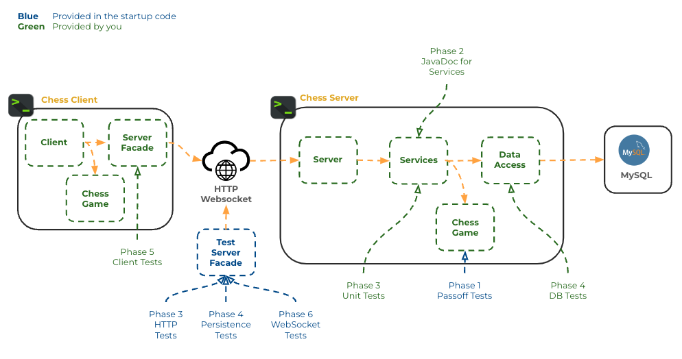

# Chess


We use the game of chess to help you develop and demonstrate mastery during this course. Your development work is
divided into six different phases. Each phase demonstrates a different architectural concept or technology.

| Phase            | Getting Started                                  | Requirements                            | Starter Code                        | Description                                                    |
|------------------|--------------------------------------------------|-----------------------------------------|-------------------------------------|----------------------------------------------------------------|
| 1. Chess game    | [doc](1-chess-game/getting-started.md)           | [doc](1-chess-game/chess-game.md)       | [dir](1-chess-game/starter-code)    | Creating the game board and enforcing the rules of play.       |
| 2. Server design | [doc](2-server-design/getting-started.md)        | [doc](2-server-design/server-design.md) | [dir](2-server-design/starter-code) | Designing the chess server.                                    |
| 3. Web API       | [doc](3-web-api/getting-started.md)              | [doc](3-web-api/web-api.md)             | [dir](3-web-api/starter-code)       | Creating an HTTP chess server.                                 |
| 4. Database      | [doc](../Phase%204/getting-started.md) | [doc](4-database/database.md)           | [dir](4-database/starter-code)      | Persistently storing players, games, and authentication.       |
| 5. Pregame       | [doc](5-pregame/getting-started.md)              | [doc](5-pregame/pregame.md)             | [dir](../../5-pregame/starter-code)       | Creating an command line interface (CLI) for the chess client. |
| 6. Gameplay      | [doc](6-gameplay/getting-started.md)             | [doc](6-gameplay/gameplay.md)           | [dir](../../6-gameplay/starter-code)      | Implementing gameplay with multiple players.                   |

## Starter Code

⚠ Each phase of the project comes with `starter code`. In order to make it easy to copy the starter files to your
personal project repository, you should clone the course repository to your development environment.

```sh
git clone https://github.com/softwareconstruction240/softwareconstruction.git

```

## Deliverables

Every phase has different deliverables. You will deliver your code for each phase, but you will also meet with a TA to
interactively pass off most phases.

| Phase            | Deliverables                                                                                      |
|------------------|---------------------------------------------------------------------------------------------------|
| 1. Chess game    | Complete pass off tests for the chess game code.                                                  |
| 2. Server design | Create javadocs for the service and database components.                                          |
| 3. Web API       | Complete pass off tests for the HTTP server<br/>Create and complete unit tests for chess service. |
| 4. Database      | Create and complete unit tests for the chess database.                                            |
| 5. Pregame       | Create and complete client unit tests.                                                            |
| 6. Gameplay      | Complete pass off tests for WebSocket server.                                                     |

The deliverables in blue represent tests provided by the course start up code that you must pass. The deliverables in
green represent unit tests that you must write and pass.



## Example

When you complete the project, you should have something similar to the following.


