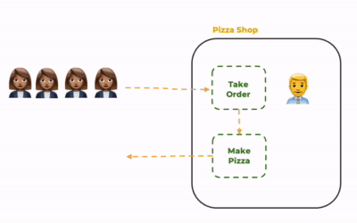
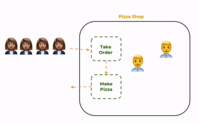

# Concurrency and Multi-threaded Programming

🖥️ [Slides](https://docs.google.com/presentation/d/1ibtqBjYEzx45Nh9eLP5xq6jWKfVjVMpv/edit#slide=id.p1)

📖 **Optional Reading**: OPTIONAL: Core Java for the Impatient, Chapter 10: Concurrent Programming

In order to understand the value of concurrent programming it is helpful examine a process that execute discrete tasks. For example, a pizza shop takes orders and makes pizzas. A shop that only has one worker can only take one order at a time and make one pizza at a time.


> _1_ - One worker, one customer

This is fine if you only have one customer at a time, but you run into trouble if multiple customers want pizzas all at the same time. Like during a lunch hour rush. With only one employee, the customers will need to wait for each previous customer to be served. This leads to unhappy customers and eventually to a decrease in profit.



> _2_ - One worker, multiple customers

We can solve this problem by hiring more workers so we can serve multiple customers at the same time, or **concurrently**. With two workers we can make pizzas twice as fast. If we add a third worker then we can make pizzas three times as fast.



> _3_ - Multiple workers, multiple customers

The pattern of concurrent execution of tasks is a foundational principle in computer science that enables increased throughput.

## Concurrency Complexities

Implementing concurrency doesn't come for free. It is more complex to hire and manage multiple workers, and if the workers cannot execute as a team you may lose all of the benefits that concurrency provides and end up with a shop that is less efficient than a shop with a single worker. These complexities can include operational overhead, resource synchronization, starvation, and deadlock. Let's look at each one individually.

### Overhead

With our pizza example, we can keep adding workers in an attempt to increase **throughput**, but at some point the shop will be too small to allow the workers to efficiently move around. When that happens, adding more workers just increase the **overhead** of each worker having to walk around each other. This will decrease the productivity of each worker and cause pizzas to be created at a slower rate. If we continue to add workers, then eventually none of them will be able to move and no pizzas will be created.

### Resource synchronization

You can also run into trouble when the workers need to **synchronize** their work on resources that cannot be shared concurrently, such as the pizza oven or cash register. Imagine what would happen if two workers tried to take and order at the same time using the same cash register. You might end up with one customer paying for another customer's pizza, or both customers getting their pizzas for free.

### Starvation

There is also the problem of one worker monopolizing a resource. For example, if a worker starts taking an order on the cash register, but then decides to go on break before completing the order. Now, no other worker can take any orders. The result is no more pizzas and everyone is unhappy. When workers cannot operate because a necessary resource is not available it is called resource **starvation**.

### Deadlock

In the pizza shop you need to have the paddle to pull a pizza out of the oven and create a pizza box to put it in. If one worker is holding the box maker while a different worker is holding the oven paddle, neither one can actually complete the pizza making process. When two workers each hold a resource that the other worker needs to get a job done, you end up with **deadlock** in your system. One of the workers must temporarily release the resource so that the work can move forward.

## Concurrent Programming in Java

The primary mechanism that makes concurrent programming work in Java is the `Thread` object.

```java
public class ThreadExample {

    public static void main(String[] args) {

        CountingThread joe = new CountingThread("Joe");
        CountingThread sally = new CountingThread("Sally");

        joe.start();
        sally.start();

        System.out.println("\nLeaving Main Thread");
    }


    static class CountingThread extends Thread {
        final String name;

        CountingThread(String name) {
            this.name = name;
        }

        public void run() {
            for (int i = 0; i != 10; i++) {
                System.out.printf("%s:%d ", name, i);
            }
        }
    }
}
```

What this program outputs will be different every time because it relies on the scheduler of your computer's processor and how content is inserted into the output stream. However, one possible output is demonstrated below. Notice that the output for the two threads are intermingled with each other, and that the main process thread actually output right in the middle of the other two threads.

```txt
Joe:0 Joe:1 Joe:2 Joe:3 Joe:4 Joe:5 Joe:6 Sally:0 Sally:1 Sally:2
Leaving Main Thread
Joe:7 Joe:8  Sally:3 Sally:4 Sally:5 Sally:6 Joe:9 Joe:10 Sally:4 Sally:5 Sally:6 Sally:7 Sally:8 Sally:9 Sally:10
```

### Threading

## Thread Pools

## Race Conditions

## Mutexes

## Synchronization

## Starvation

## Database Transactions

## Threading Overhead

## Things to Understand

- What is a thread?
- Creating and executing a simple thread in Java
- Using a thread pool (ExecutorService in Java) to run multiple threads
- What is a race condition (or race hazard)?
- How to use database transactions to avoid race conditions
- How to use "synchronized" methods and code blocks in Java to avoid race conditions
- How to avoid race conditions in the Chess server and client programs

## Demonstration code

📁 [Java Thread Example](example-code/src/demo/JavaThreadExample.java)

📁 [Java Thread Pool Example](example-code/src/demo/JavaThreadPoolExample.java)

📁 [File Race Condition Example](example-code/src/demo/FileRaceConditionExample.java)

📁 [Synchronized Stack Example](example-code/src/demo/Stack.java)
