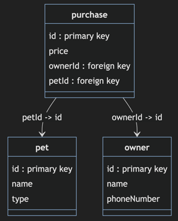

# Relational Databases - The Relational Model

🖥️ [Slides](https://docs.google.com/presentation/d/19nC7v6SDqoEeK75Mb-f6L3QhnbuP6Xfo/edit?usp=sharing&ouid=114081115660452804792&rtpof=true&sd=true)


> _source: [Wikipedia](https://en.wikipedia.org/wiki/Edgar_F._Codd)_

> “At the time, Nixon was normalizing relations with China. I figured that if he could normalize relations, then so could I.”
>
> — Edgar Cobb

Relational databases are commonly used to persistently store and retrieve data. You can read and write data to a relational database from your program using the structured query language (SQL). Your code executes SQL statements against a database using standard library classes know as Java Database Connectivity (JDBC) package. Before we dive into how you actually write an application that uses a database, we first want to discuss how relational databases work.

At a basic level, relational data is stored in a `database`. A database contains `tables`, and a table has a number of `columns` that define the fields of the table. This can be things like `name`, `phone number`, or `id`. When you insert data into a database table it becomes a `row` in the table. The inserted data must have fields that matches each of the tables columns.

| column1 | column2 | column3 |
| ------- | ------- | ------- |
| row1    | row1    | row1    |
| row2    | row2    | row2    |
| row3    | row3    | row3    |

Usually each table in a relational database will have a column that represents a unique ID for the table. You use the ID to request data back out of the table.

## Mapping Objects to Tables

Sometimes it is helpful to think about relational databases in the context of objects in your code. If you have a Java record in your code that represents the data for a pet, and you create three object from the `Pet` record definition, it might look like this the following.

```java
record Pet(int id, String name, String type){}

var pets = Pet[]{
    new Pet(93, "Fido", "dog"),
    new Pet(14, "Puddles", "cat"),
    new Pet(77, "Chip", "bird")
}
```

Using this example you can map the Java record declaration directly to a relational database table definition. The fields in the record map to the columns of the table. The Java record and the database table share the strong typing in their different representations. Each of the Java Pet objects in the array, map to a row in the database table. The following table is a relational representation of the Java code above.

**Pet table**

| id  | name    | type |
| --- | ------- | ---- |
| 93  | Fido    | dog  |
| 14  | Puddles | cat  |
| 77  | Chip    | bird |

## Table Relationships

The term `relational` in relational databases refers to the relationships that exist between tables. Relational databases seek to strictly follow the single responsibility principle and only represent one type of data in every table. Once you have represented cohesive data into different tables, you then create relationships between tables by referencing keys between tables.

The following gives a simple visualization of a database named `pet-store` that contains a table for `pet`, `owner`, and `purchase`. The `pet` and `owner` tables are related to each other because of the key relationship defined in the `purchase` table. The purchase table maps what owner purchased which pet.

**pet**

| id  | name    | type |
| --- | ------- | ---- |
| 93  | Fido    | dog  |
| 14  | Puddles | cat  |
| 77  | Chip    | bird |

**owner**

| id  | name | phoneNumber |
| --- | ---- | ----------- |
| 81  | Juan | 6196663333  |
| 82  | Bud  | 8018889999  |

**purchase**

| id  | ownerId | petId |
| --- | ------- | ----- |
| 51  | 81      | 93    |
| 52  | 82      | 77    |

With your data stored in relational tables you can use the different ID fields of the table to cross-reference, or join, the data together to create new views of the data. A table column that represents the unique ID of the table data is called the `primary key` of the table. When a table column contains the primary key of a different table, it is called a `foreign key`.



A good primary key has the following characteristics.

- **Unique** - The key must be unique.
- **Stable** - The key doesn't change over time. For example, a person's name would be considered unstable because it could change during the person's life.
- **Simple** - Sometimes multiple fields must be combined to create a unique key that is representative of the row. However, you should attempt to keep the key as simple as possible because you reference the key so often when working with relational databases.

## Views

You can create new views of the relational data by specifying queries that `join` data from different tables based upon matching keys.

From the pet store tables we defined above, we could create a different view of the data with a query that joined the owner name with the pet's name based upon the ID fields found in the purchase table. This query might look something like:

```text
Join the owner and pet data together based upon matching pet IDs.
```

This would result in a view that would look like the following.

| ownerId | ownerName | petId | petName |
| ------- | --------- | ----- | ------- |
| 81      | Juan      | 93    | Fido    |
| 82      | Bud       | 77    | Chip    |

Data views are usually only created temporarily so that an application can use the aggregated data to facilitate the functionality of the application. That means they are created in memory and then thrown away once the application is done with them.

## Working with Relational Data

In practical terms, relational data is store in a Relational Database Management System (RDBMS). For this course, we will use MySQL as our RDBMS. The language most commonly used to read, write, and query relational data is called Structure Query Language (SQL). We will discuss this declarative language as a future topic.

## Things to Understand

- How data is represented in the relational model
- How primary and foreign keys work
- How to represent one-to-one, one-to-many, and many-to-many relationships using primary and foreign keys
- What makes a good primary key
- How to model inheritance relationships in the relational model
- How to represent a data model in an ERD

## Videos

- 🎥 [Relational Databases Overview](https://byu.hosted.panopto.com/Panopto/Pages/Viewer.aspx?id=10667c35-dea3-4f1e-8c91-ad66013d553b&start=0)
- 🎥 [Understanding the Relational Model](https://byu.hosted.panopto.com/Panopto/Pages/Viewer.aspx?id=3ec3f6de-a112-4e0a-a0af-ad66013f8bc7&start=0)
- 🎥 [Modeling a Database Schema](https://byu.hosted.panopto.com/Panopto/Pages/Viewer.aspx?id=ee130025-e1ab-4f6b-a72c-ad660143e8aa&start=0)
- 🎥 [Modeling Inheritance Relationships](https://byu.hosted.panopto.com/Panopto/Pages/Viewer.aspx?id=6bb9d1f1-803c-4d8f-a5ea-ad660146883e&start=0)
